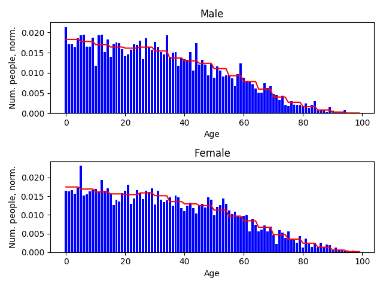
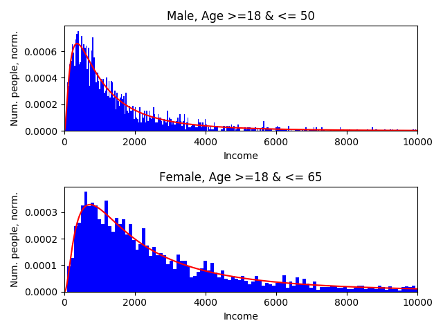

File properties
===============

YAML configuration file
-----------------------

In this section the possible variables of the YAML configuration files can
are discussed. The validity of these rules are checked by the function
``simago.yamlutils.check_yaml``.

*

Property: Age
-------------
The treatment of the 'age' is a little more complicated than the
property of 'sex'. In this case we let the age of a person depend on their sex.
This follows from the data that was gathered; the age distribution is different
for males and females.
The settings file of the 'age' property is as follows:

.. code-block:: yaml

    property_name: "age"
    data_type: "ordinal"

    data_file: "./data/age.csv"

    conditionals: "./data/age_conditionals.csv"

The data type in this case is ``ordinal`` because one can make an ordering of
people based on their age; some people are older or younger than others. When we
take a look at the data file we see (shortened for readability):

.. code-block::

    option,value,label,conditional_index
    0,69623692.0,0,0
    1,69623692.0,1,0
    2,69623692.0,2,0
    ...
    97,202110.8,97,0
    98,202110.8,98,0
    99,202110.8,99,0
    0,65323152.2,0,1
    1,65323152.2,1,1
    2,65323152.2,2,1
    ...
    97,556794.6,97,1
    98,556794.6,98,1
    99,556794.6,99,1

In this case we see that some rows correspond to ``conditional_index`` of 0 and
others to 1. These indices match to the conditions given in the conditionals file mentioned
at the ``conditionals`` parameter in the settings file. This conditionals file
looks like this:

.. code-block::

    conditional_index,property_name,option,relation
    0,sex,0,eq
    1,sex,1,eq

Here we see two conditions corresponding to the conditional
index of 0 and 1. In this case the values for the options mentioned in the data
file with ``conditional_index == 0`` hold when the property 'sex' is equal to
option 0, which in this case means the sex is male. The values in the data file
with ``conditional_index == 1`` correspond to option 1 for property 'sex' which is
female. The values in the data file are normalized for each conditional index.
These normalized values will then form the discrete conditional probability for
a person to be of a certain age given that they are of a certain sex.

Property: Income
----------------
Where for categorical and ordinal variables the settings files are mainly a way
to indicate where the relevant files are stored, the settings files for
continuous variables such as 'income' contain a bit more information. Let's take
a look at the settings file in this example:

.. code-block:: yaml

    property_name: "income"
    data_type: "continuous"

    pdf_parameters: [[1000, 1], [2000, 1]]
    pdf_file: "./pdfs/pdf.py"
    pdf: "pdf_lognorm"

    conditionals: "./data/income_conditionals.csv" # null if no conditionals

For each continuous variable a continuous
probability density function in the form of an ``rvs_continuous`` object from the
``scipy.stats`` package needs to be supplied. The name of the function for this
probability density function is in this case ``pdf_lognorm`` in the file mentioned
under ``pdf_file``. Ths file looks as follows:

.. code-block:: python

    from scipy.stats import lognorm

    def pdf_lognorm(params):
        """
        This function returns an instance of scipy.stats.norm
        with the correct paramters
        s = sigma
        scale = exp(mu)
        """
        scale = params[0]
        s = params[1]
        return lognorm(s=s, scale=scale)

The parameters for this function can be varied with the conditional index. They
are selected by taking the values in the position of the list
``pdf_parameters`` corresponding to the conditional index. To see what these
conditional indices mean we look at the conditionals file:

.. code-block::

    conditional_index,property_name,option,relation
    0,sex,0,eq
    0,age,18,geq
    0,age,50,leq
    1,sex,1,eq
    1,age,18,geq
    1,age,65,leq

Multiple conditions for each ``conditional_index`` are combined. In this case
``conditional_index`` of 0, and therefore the parameters ``[1000, 1]`` correspond to
every person that

- is male,
- has an age greater than or equal to 18
- and less than or equal to 50.

The parameters ``[2000, 1]`` associated with a ``conditional_index``
of 1 are for every person that

- is female,
- has an age greater than or equal to 18
- and less than or equal to 65.

Probability and Population objects
----------------------------------
All the information on each of the properties is each encapsulated in their own
``ProbabilityClass`` object. All the ``ProbabilityClass`` objects of the properties are
then incorporated into a ``PopulationClass`` object. By calling the ``update()``
method of the ``PopulationClass`` object the values are drawn from the (conditional)
probability distributions that were supplied.

Resulting data
--------------
If we look at the resulting data, we see that the characteristics roughly match
the supplied aggregated data. This is what we expected seen as these values are
all randomly drawn.

+--------+------------+------------+
| Sex    | Original   | Generated  |
+========+============+============+
| Male   | 0.504      | 0.508      |
+--------+------------+------------+
| Female | 0.496      | 0.492      |
+--------+------------+------------+

