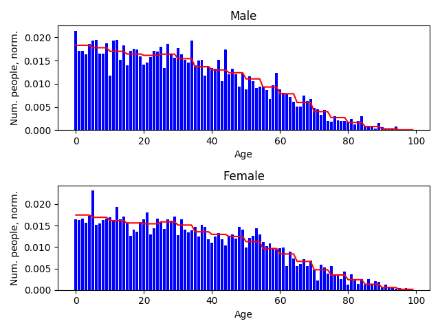
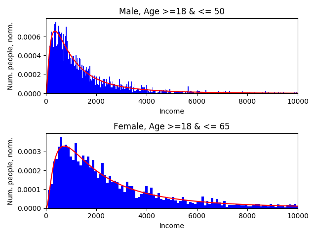

Example
=======

To introduce the workings of the Simago package a basic example is supplied.
With this example a population can be generated with three properties per
person:

- Sex: male or female
- Age: 0 to 99+, dependent on the sex of the person
- Income: A continuous lognormal distribution, dependent on the age and sex of the person.

The data for the distributions of for the properties 'sex' and 'age' are from
`https://www.populationpyramid.net/ <https://www.populationpyramid.net/>`_ for the
year 2017. In the folder ``conversion_scripts`` some scripts are found to
transform the downloaded CSV to the format used by Simago. The data for the
``income`` property is fictional and solely to demonstrate the functionality.

In this example the actual population is generated by calling the ``simago``
package directly and supplying some arguments via ``argparse``. To replicate
the example the following expression can be used:

.. code-block:: bash

    python -m simago -p 1000 --yaml-folder ./data-yaml/ -o ./output/population.csv --rand_seed 100

In the Python script the following code is executed:

.. code-block:: python

    population = generate_population(args.popsize, args.yaml_folder, args.rand_seed)
    population.update()
    population.export(args.output, nowrite=args.nowrite)

In the first line the function ``generate_population`` is supplied with the
population size, the path to the folder containing the settings (YAML) files and a
seed for random number generation. This function then generates a ``PopulationClass``
object which contains all the information about the properties and the probability
distributions as defined in the settings files. By calling ``population.update()``
the actual random values for all the defined properties and all persons in the population
are drawn. After this the population is contained in the population object as
the Pandas DataFrame ``population.population``. To write this DataFrame to a
file, the ``export()`` method can be called. In this case ``args.output`` is the path
where to write the file. To just print the population DataFrame to the console
the argument ``nowrite`` can be set to True.

Now we will walk through the way the settings and data files are defined for
each of the properties.

Property: Sex
-------------
For each property a settings file must be defined in the form of a YAML file.
For this example all the settings files for the example are stored in
``./example/data-yaml/``. For the property 'sex' this looks as follows:

.. code-block:: yaml

    property_name: "sex"
    data_type: "categorical"

    data_file: "../data/sex.csv"

    conditions: null # null if no conditions

Every property needs to have a unique property name; in this case the obvious
choice has been made. As a data type there currently are three possible options:

- categorical: Discrete options with no ordering.
- ordinal: Discrete options with an order in them.
- continuous: Continuous values.

In the case of the sex of a person there we here consider 'male' and 'female'
which makes it a categorical variable, because there is no ordering. In the data
file the known data can be found, which will be used to create the probability
distribution. The data file in this case looks as follows:

.. code-block:: yaml

    option,value,label,condition_index
    0,3805370719,male,0
    1,3742018211,female,0

The ``option`` in the first column is a unique index for each of the possible
outcomes of the variable. In this case the options are 0 and 1 which each correspond
to the human readable ``label`` of 'male' and 'female'. In the case of the
property 'sex' the total amount of males and females are shown. The normalized
values for each option will form the discrete probability distribution.

The column for ``condition_index`` is not used for this property and in the
settings file ``conditions`` is set to ``null``. These options are used when the
the probabilities for a certain property depend on another property. This will
be a factor for 'age' and 'income'.

Property: Age
-------------
The treatment of the 'age' is a little more complicated than the
property of 'sex'. In this case we let the age of a person depend on their sex.
This follows from the data that was gathered; the age distribution is different
for males and females.
The settings file of the 'age' property is as follows:

.. code-block:: yaml

    property_name: "age"
    data_type: "ordinal"

    data_file: "../data/age.csv"

    conditions: "../data/age_conditions.csv"

The data type in this case is ``ordinal`` because one can make an ordering of
people based on their age; some people are older or younger than others. When we
take a look at the data file we see (shortened for readability):

.. code-block:: yaml

    option,value,label,condition_index
    0,69623692.0,0,0
    1,69623692.0,1,0
    2,69623692.0,2,0
    ...
    97,202110.8,97,0
    98,202110.8,98,0
    99,202110.8,99,0
    0,65323152.2,0,1
    1,65323152.2,1,1
    2,65323152.2,2,1
    ...
    97,556794.6,97,1
    98,556794.6,98,1
    99,556794.6,99,1

In this case we see that some rows correspond to ``condition_index`` of 0 and
others to 1. These indices match to the conditions given in the conditions file mentioned
at the ``conditions`` parameter in the settings file. This conditions file
looks like this:

.. code-block:: yaml

    condition_index,property_name,option,relation
    0,sex,0,eq
    1,sex,1,eq

Here we see two conditions corresponding to the condition
index of 0 and 1. In this case the values for the options mentioned in the data
file with ``condition_index == 0`` hold when the property 'sex' is equal to
option 0, which in this case means the sex is male. The values in the data file
with ``condition_index == 1`` correspond to option 1 for property 'sex' which is
female. The values in the data file are normalized for each condition index.
These normalized values will then form the discrete conditional probability for
a person to be of a certain age given that they are of a certain sex.

Property: Income
----------------
Where for categorical and ordinal variables the settings files are mainly a way
to indicate where the relevant files are stored, the settings files for
continuous variables such as 'income' contain a bit more information. Let's take
a look at the settings file in this example:

.. code-block:: yaml

    property_name: "income"
    data_type: "continuous"

    pdf_parameters: [[1000, 1], [2000, 1]]
    pdf_file: "../pdfs/pdf.py"
    pdf: "pdf_lognorm"

    conditions: "../data/income_conditions.csv"

For each continuous variable a continuous probability density function in the
form of an 'frozen' ``rv_continuous`` object from the ``scipy.stats`` package
needs to be supplied. An ``rv_continuous`` object becomes frozen when it is
initiated with the parameters for the probability distribution specified. The
name of the function for this probability density function is in this case
``pdf_lognorm`` in the file mentioned under ``pdf_file``. Ths file looks as
follows:

.. code-block:: python

    from scipy.stats import lognorm

    def pdf_lognorm(params):
        """
        This function returns an instance of scipy.stats.norm
        with the correct paramters
        s = sigma
        scale = exp(mu)
        """
        scale = params[0]
        s = params[1]
        return lognorm(s=s, scale=scale)

The parameters for this function can be varied with the condition index. They
are selected by taking the values in the position of the list
``pdf_parameters`` corresponding to the condition index. To see what these
condition indices mean we look at the conditions file:

.. code-block:: yaml

    condition_index,property_name,option,relation
    0,sex,0,eq
    0,age,18,geq
    0,age,50,leq
    1,sex,1,eq
    1,age,18,geq
    1,age,65,leq

Multiple conditions for each ``condition_index`` are combined. In this case
``condition_index`` of 0, and therefore the parameters ``[1000, 1]`` correspond to
every person that

- is male,
- has an age greater than or equal to 18
- and less than or equal to 50.

The parameters ``[2000, 1]`` associated with a ``condition_index``
of 1 are for every person that

- is female,
- has an age greater than or equal to 18
- and less than or equal to 65.

Probability and Population objects
----------------------------------
All the information on each of the properties is each encapsulated in their own
``ProbabilityClass`` object. All the ``ProbabilityClass`` objects of the properties are
then incorporated into a ``PopulationClass`` object. By calling the ``update()``
method of the ``PopulationClass`` object the values are drawn from the (conditional)
probability distributions that were supplied.

Resulting data
--------------
If we look at the resulting data, we see that the characteristics roughly match
the supplied aggregated data. This is what we expected seen as these values are
all randomly drawn.

+--------+------------+------------+
| Sex    | Original   | Generated  |
+========+============+============+
| Male   | 0.504      | 0.508      |
+--------+------------+------------+
| Female | 0.496      | 0.492      |
+--------+------------+------------+

